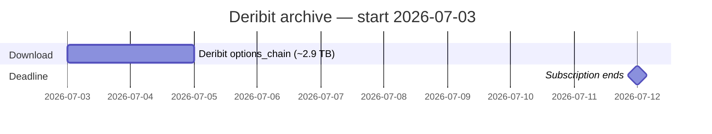
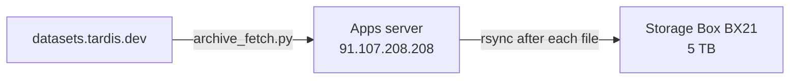

# Tardis Raw Archive Plan

**Status:** **bulk run in progress** (tmux `tardis-archive` on apps server)  
**Subscription ends:** 2026-07-12  
**Bulk started:** 2026-07-02 (UTC)  
**Progress:** 2/458 days in manifest; **456 jobs** running (newest-first from 2026-07-12)  
**Scope:** **Deribit only** (phase 1)

Download-only archive of Deribit `options_chain` / `OPTIONS.csv.gz` files to a Hetzner Storage Box before the academic API key lapses. No gzip→parquet processing during archive.

Other exchanges (Binance, OKX, Bybit) are deferred until a larger Storage Box is available.

Related: [`BULK_DOWNLOAD_PLAN.md`](BULK_DOWNLOAD_PLAN.md) (extract pipeline), [`TARDIS_DATA_NOTES.md`](TARDIS_DATA_NOTES.md) (data quality).

---

## What to download (phase 1)

| Exchange | Files | Est. size |
|----------|------:|----------:|
| **deribit** | **458** | **~2.9 TB** |

- **Window:** 2025-04-11 → 2026-07-12
- **URL pattern:** `https://datasets.tardis.dev/v1/deribit/options_chain/{Y}/{M}/{D}/OPTIONS.csv.gz`
- **Not in scope (phase 1):** binance-european-options, okex-options, bybit-options, trades, quotes, L2 book

---

## Schedule

Subscription last day: **2026-07-12**. One sequential downloader on the apps server at **~40 MB/s**.

| Goal | Est. volume | Est. duration | Start by |
|------|------------:|--------------:|----------|
| **Deribit (phase 1)** | ~2.9 TB | **~1 day** | **2026-07-03** |



**Before starting:** pause any other downloads on this API key (shared quarterly quota; one IP at a time).

**Transfer quota:** 60 TB/quarter — more than enough for ~2.9 TB.

---

## Infrastructure



| Component | Details |
|-----------|---------|
| **Download host** | `root@91.107.208.208` (UbuOtherApps). Path: `/apps/tardis-archive/`. **Do not use trading VPS** `46.225.137.92`. |
| **Storage Box** | **BX21 (5 TB)** — sufficient for Deribit ~2.9 TB with headroom. Nuremberg, SSH/rsync enabled. |
| **Process model** | Single sequential worker — one file at a time, delete local after rsync |
| **Staging disk** | ~10 GB peak on apps server (one gz + headroom) |

### Storage Box layout

```
tardis_raw/
├── manifest.jsonl
└── deribit/
    └── options_chain_2025-04-11.csv.gz
    └── ...
```

---

## Prerequisites

Before the run:

- [x] `archive_fetch.py` + `tardis_common.py` implemented (hardened: retries, lock, resume, failures log)
- [x] Storage Box BX21 provisioned and rsync-tested from apps server (`provision_storage_box.sh` passed)
- [x] `.env` on apps server (`TARDIS_API_KEY`, `STORAGE_BOX_*`, SSH key at `/root/.ssh/id_ed25519`)
- [x] Collaborator paused; only apps server uses the API key

---

## Step 1 — Provision Storage Box

1. Create **BX21 (5 TB)** Storage Box in Nuremberg.
2. Enable SSH / rsync; note host, user, password or key.
3. From apps server, test upload:

```bash
ssh root@91.107.208.208
cd /apps/tardis-archive && source .env
bash provision_storage_box.sh
```

---

## Step 2 — Deploy to apps server

From your Mac (CryoBacktester repo root):

```bash
rsync -av backtester/ingest/tardis/ \
  root@91.107.208.208:/apps/tardis-archive/

ssh root@91.107.208.208 'cd /apps/tardis-archive && python3 -m venv .venv && \
  .venv/bin/pip install -q requests && mkdir -p logs staging'
```

Create `/apps/tardis-archive/.env` (never commit):

```bash
TARDIS_API_KEY=your_key_here
STORAGE_BOX_HOST=uXXXX.your-storagebox.de
STORAGE_BOX_USER=uXXXX
STORAGE_BOX_BASE=tardis_raw
STORAGE_BOX_PORT=23
```

---

## Step 3 — Smoke test (one day)

```bash
ssh root@91.107.208.208
cd /apps/tardis-archive && source .venv/bin/activate && source .env

python archive_fetch.py --exchange deribit \
  --from 2026-06-01 --to 2026-06-01 \
  --upload-base ${STORAGE_BOX_USER}@${STORAGE_BOX_HOST}:${STORAGE_BOX_BASE}/deribit/
```

Confirm: file on Storage Box, line in `logs/manifest.jsonl`, local staging empty.

---

## Step 4 — Bulk download (Deribit)

```bash
ssh root@91.107.208.208
cd /apps/tardis-archive && bash start_archive_bulk.sh
# or manually:
tmux new -s tardis-archive
cd /apps/tardis-archive && source .venv/bin/activate && source .env

python archive_fetch.py \
  --exchange deribit \
  --from 2025-04-11 --to 2026-07-12 \
  --upload-base ${STORAGE_BOX_USER}@${STORAGE_BOX_HOST}:${STORAGE_BOX_BASE}/deribit/ \
  2>&1 | tee logs/archive.log
```

Detach: `Ctrl-B D` — reattach: `tmux attach -t tardis-archive`

**Per-file loop** (inside `archive_fetch.py`):

1. Skip if `{exchange, date}` already in manifest
2. Download `OPTIONS.csv.gz` → `staging/`
3. `gzip -t` integrity check
4. `rsync` to Storage Box
5. Append `manifest.jsonl` (includes `bytes_downloaded`)
6. Delete local file

Newest-first. Resumes automatically from manifest if interrupted.

---

## Step 5 — Monitor

```bash
tail -f /apps/tardis-archive/logs/archive.log
wc -l /apps/tardis-archive/logs/manifest.jsonl    # target: 458
grep '"exchange":"deribit"' logs/manifest.jsonl | wc -l

ssh ${STORAGE_BOX_USER}@${STORAGE_BOX_HOST} 'du -sh tardis_raw/deribit'
```

---

## Step 6 — Verify (by 2026-07-12)

- [ ] `manifest.jsonl` has **458** Deribit entries (or document gaps)
- [ ] `gzip -t` passes on 2–3 random files on Storage Box
- [ ] Total bytes in manifest ≈ **~2.9 TB**
- [ ] Keep Storage Box ~3 months; downgrade or delete when processing is done

---

## Phase 2 (later, optional)

If you upgrade to a larger Storage Box, run `archive_fetch.py` for the other exchanges (Binance → OKX → Bybit). The script already supports `--priority-mode deribit-first` for multi-exchange runs.

---

## Post-archive (later, separate task)

1. `rsync` Deribit files from Storage Box to a machine with the backtester
2. [`stream_extract.py`](stream_extract.py) + [`clean.py`](clean.py) per day
3. [`fixup_midnight.py`](fixup_midnight.py) after all Deribit days extracted
4. Gap after 2026-07-12: CryoTrader live recorder via [`sync_vps.py`](../sync_vps.py)

---

## Risks

| Risk | Mitigation |
|------|------------|
| Key expires mid-run | Start by Jul 3; newest-first dates |
| Partial download | No HTTP Range — delete partial gz and retry |
| Tardis empty-file day | Skip via probe (see `retry_missing.sh` pattern) |
| Apps server disk full | Delete local file after each successful rsync |
| HTTP 403 | Log response body; may be transfer limit or unavailable date |
| Two users on one key | Coordinate — one IP/machine only during archive |

---

## Checklist

- [x] Storage Box **BX21 (5 TB)** provisioned (`u626177@u626177.your-storagebox.de`, base `tardis_raw/`)
- [x] `archive_fetch.py` + `tardis_common.py` implemented (day/rsync retries, partial resume, lock, `fsync` manifest)
- [x] Deployed to `/apps/tardis-archive/` on `91.107.208.208`
- [x] `.env` configured on apps server (API key + Storage Box creds)
- [x] Smoke tests passed (`2026-06-01` 6.1 GB, `2026-06-02` 8.5 GB — download, `gzip -t`, rsync, manifest)
- [x] Bulk run started **2026-07-02** (`bash start_archive_bulk.sh` → tmux `tardis-archive`, 456 jobs remaining)
- [ ] **458/458** Deribit files in manifest by **2026-07-12** (currently **2/458**)
